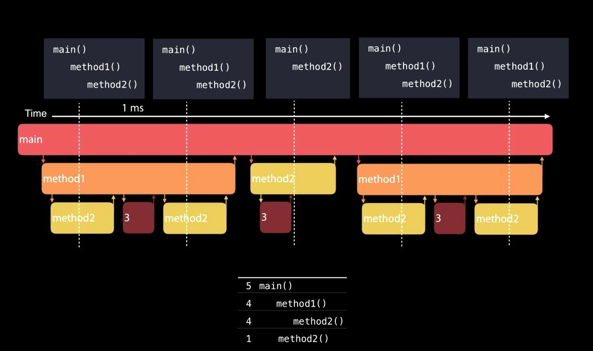
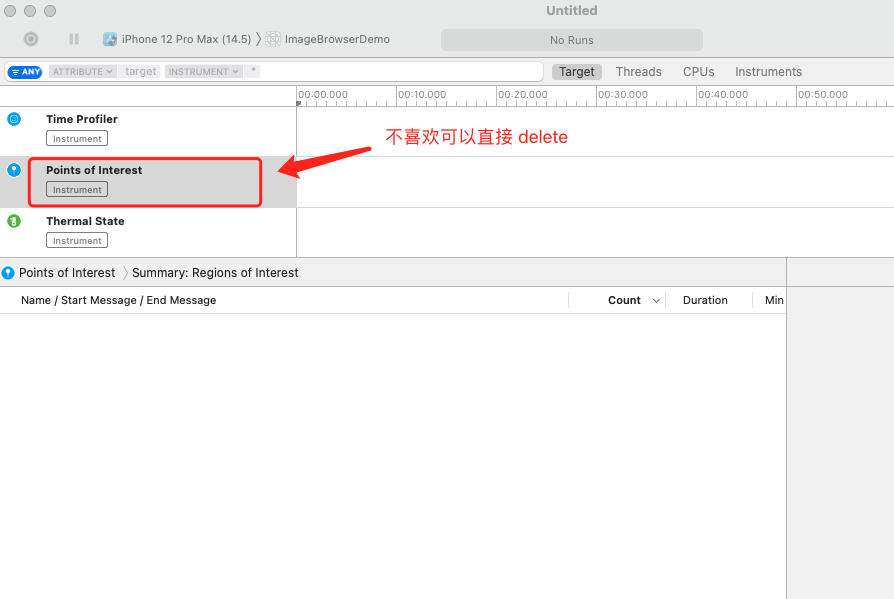
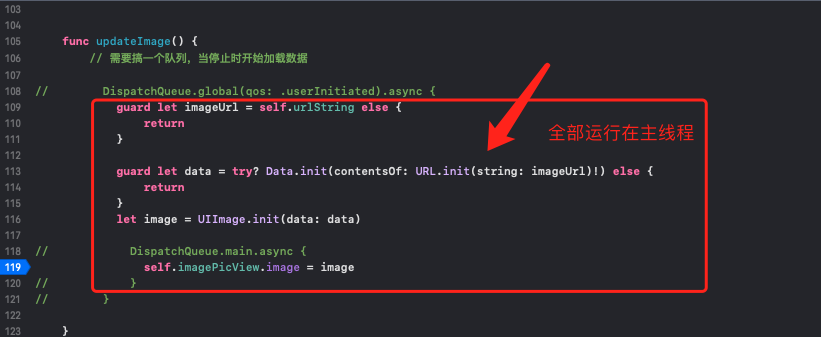
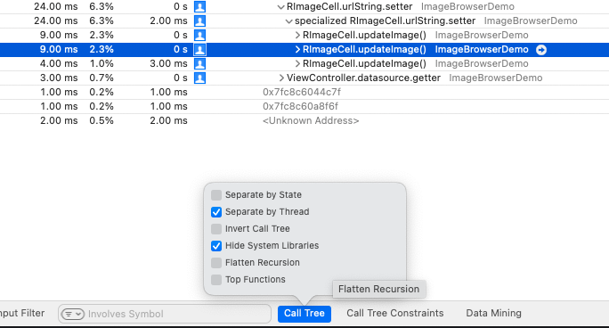
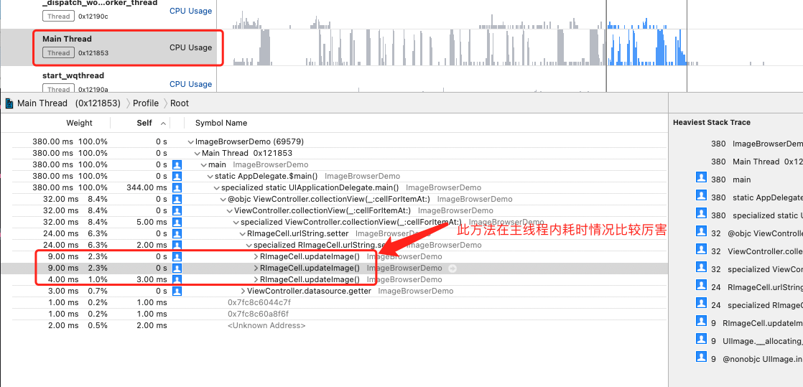
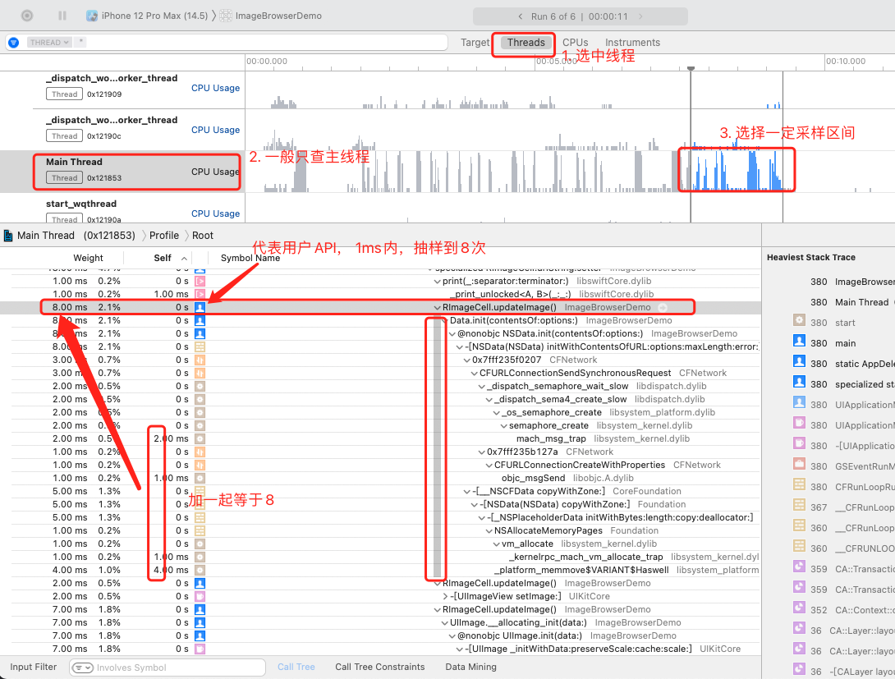
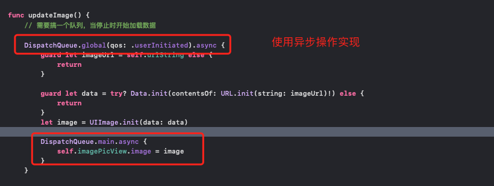
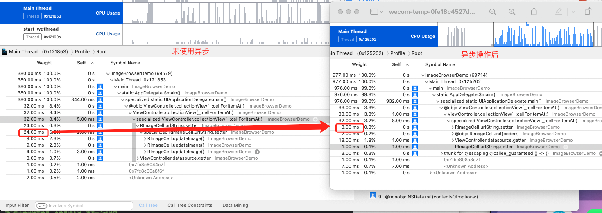

# TimeProfiler使用记录

## 原理

`Time Profile`每隔1ms就会对线程的调用栈采样，然后用统计学的方式去做出分析



> 上图虚线是采样点，最后统计出调用栈和对应函数出现的个数
>
> 从上图可以发现，`3` 并没有出现在统计结果中，也就意味着<b>方法运行的足够快的时候，很有可能统计不到</b>，不过这也没什么影响，运行快的方法往往不会引起性能问题


> `Tips`：`Timeprofiler`并不会精确统计出方法的执行时间，当线程处于挂起和等待执行的状态是，`timer profiler`并不能统计到，它只能统计到真正再`CPU`上执行的


### 分析点

1. 一般是分析主线程就行
2. 一般是分析 `self weight` 【自重】比较重的项
3. 调试的目标： 自己的自重降到最低，自重比较大的系统API放到非`main`线程


## 准备工作
使用工程:`ImageBrowserDemo`

## 执行`Profile`打开`Time Profiler`




## 1. 使用代码效果，并执行效果




### 分析效果：
可以通过隐藏系统API方式来精简



补充描述：

> separate by Thread: 按线程分开分析，更容易揪出哪些吃资源的线程问题
>
> Invert Call Tree: 反向输出调用树。把调用层级最深的方法显示在最上面，更容易找到最耗时的操作
>
> Hide System Libraries: 隐藏系统库文件，过滤掉各种系统调用，只显示自己代码
>
> Flattern Recursion: 拼合递归。将同一递归函数产生的多条堆栈合并为一条【递归函数会调用自己】
>
> Top Functions: 找到耗时最多的函数/方法


### 先通过整体权重，找到用户`API`占比情况



### 如果不先通过上述查看，直接看下图可能比较懵逼



从上图可以看出方法`RImageCell.updateImage()`调用抽样次数在主线程比较多，因为系统`API`耗时操作都放到了主线程，所以才出现这种问题，可以通过子线程处理方案来优化

## 2. 使用异步来优化方案
### 代码参考如下



### 对比上次性能分析



> 对比分析可以发现，原来`1ms`内能捕获到`setter`方法`24`次，现在只能捕获到`3`次，大大提升了性能


<b>至于使用异步会造成的并发症，比如顺序无法把控，可以使用缓存，及队列机制来进行完善，不在此列记录</b>


## 名词解释

* `weight`: 权重， 以时间和百分比标识

> 通俗意思：指定时间，此方法在采样堆栈出现的次数
>
> 书面意思：衡量函数再调用堆栈上的时间量

```
weight 46 ms, 在这段时间里(1ms)，此方法被采样46次
```

* ` self weight`：自重，以时间为标识， 性能调试更加重要

> 通俗意思：指定时间，此方法处于堆栈最后面的次数
>
> 书面意思：衡量函数位域调用堆栈顶部的时间量

```
self weight 1 ms, 这段时间里，采样时，此方法在调用堆栈最后面1次
self weight 0 ms, 这段时间里，采样时，此方法一次也没有在调用堆栈最后面，也就是这个方法没有干实事，全是调用其他方法做事的
```

