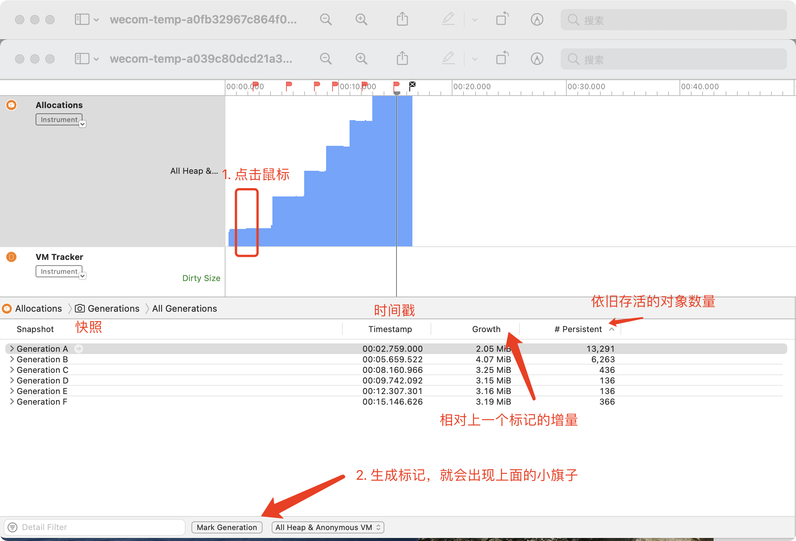

# Allocations 操作记录

## 这货是用来分析啥的

`Allocations`分析模板使用`Allocations`和`VM Tracker`	工具来测量应用程序中的一般和虚拟内存使用情况。

可以通过`Allocations` 这个工具来追踪已分配但不再使用的内存信息。

通俗点讲：用来记录内存分配及状态的工具

## 分析点

* 看哪些方法比较耗费内存

## 代码准备

## 操作记录

### 1. 使用标记一代代记录

### 2. 统计方式查看

### 3. 调用树

### 4. 内存分配列表

## 总结
这个实际排查内存泄露的方案并不那么好用，只能用来看内存分配的情况，如果需要排查内存泄露还是需要使用`Leaks`工具查看

